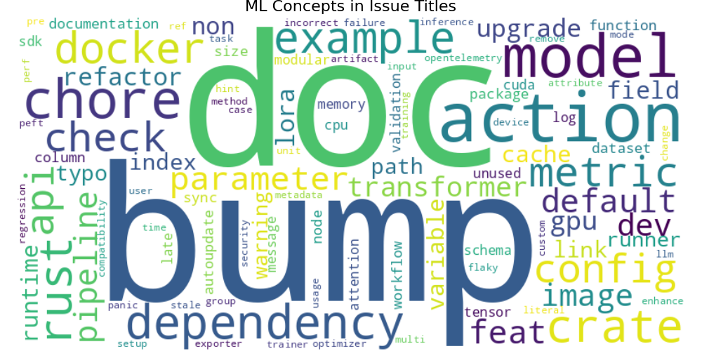
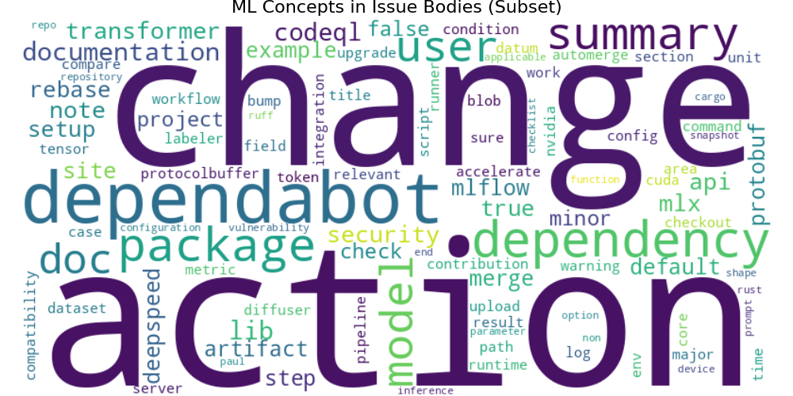
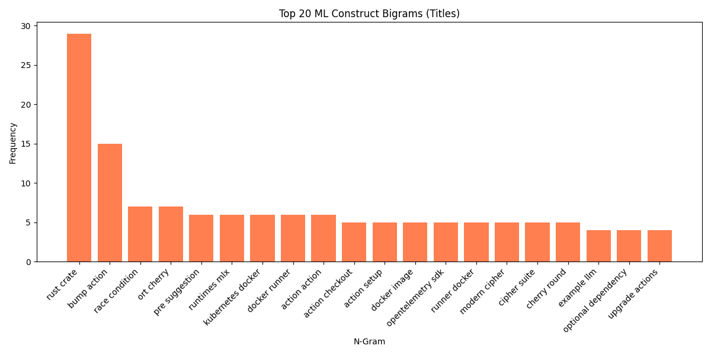
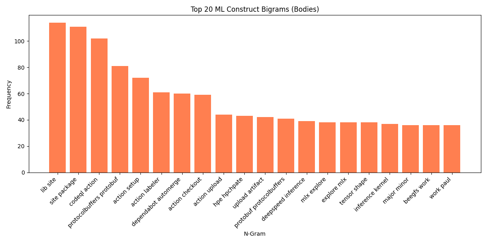
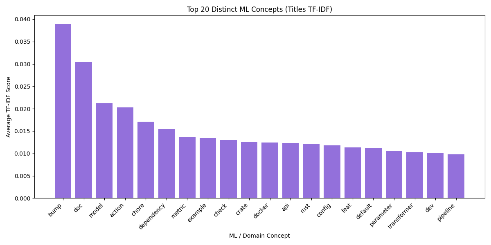
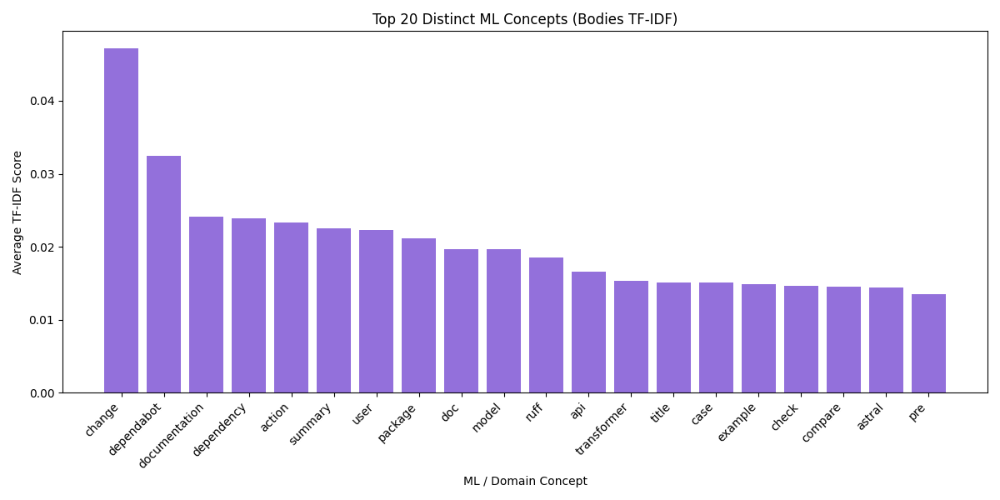

# ML Domain Exploratory Data Analysis (EDA) Report

**Date:** 2026-03-01 12:20:07
**Data Source:** `../../../crawler/data/2026-03-01-02-45/knowledge_base.jsonl`

## 1. Domain-Specific Methodology
To satisfy the ML-centric objective, this EDA relies heavily on NLP Part-of-Speech Tagging (via `spacy`) to extract only strictly NOUN, PROPN, and ADJ tags.
It aggressively strips away all GitHub template filler (e.g., 'expected behavior', 'logs', 'fix'), general programming constructs ('def', 'return', 'import'), and literal framework names ('tensorflow', 'pytorch').
This leaves behind only the core ML concepts, hardware logic, and specific algorithmic discussions.

## 2. Text Content Analysis (Filtered ML Concepts Only)

### 2.1 Concept Clouds
Visualizations of the most prominent ML concepts being discussed.

#### Titles

#### Bodies

### 2.2 Construct Bigrams
Bigrams explicitly showing coupled relationships between conceptual nouns (e.g., 'memory leak', 'cuda graph', 'flash attention').

### 2.3 Highly Distinct Entities (TF-IDF)
TF-IDF isolates highly descriptive models, parameters, or hardware configurations that differentiate issues.

## 3. Implications for the Cross-Encoder Model
1. **Data is Extremely Specialized**: The data is dominated by lower-level systems architecture terms ('cuda', 'tensor', 'kernel') rather than generic high-level 'NLP' words. The Cross-Encoder model MUST have a vocabulary that tokenizes these well (e.g. `bge-reranker`).
2. **Dense Meaning**: Because issues can be stripped down to such dense conceptual chunks, we should consider passing clean, filtered text to the cross-encoder instead of raw stack traces, to maximize token capacity (512 tokens).
