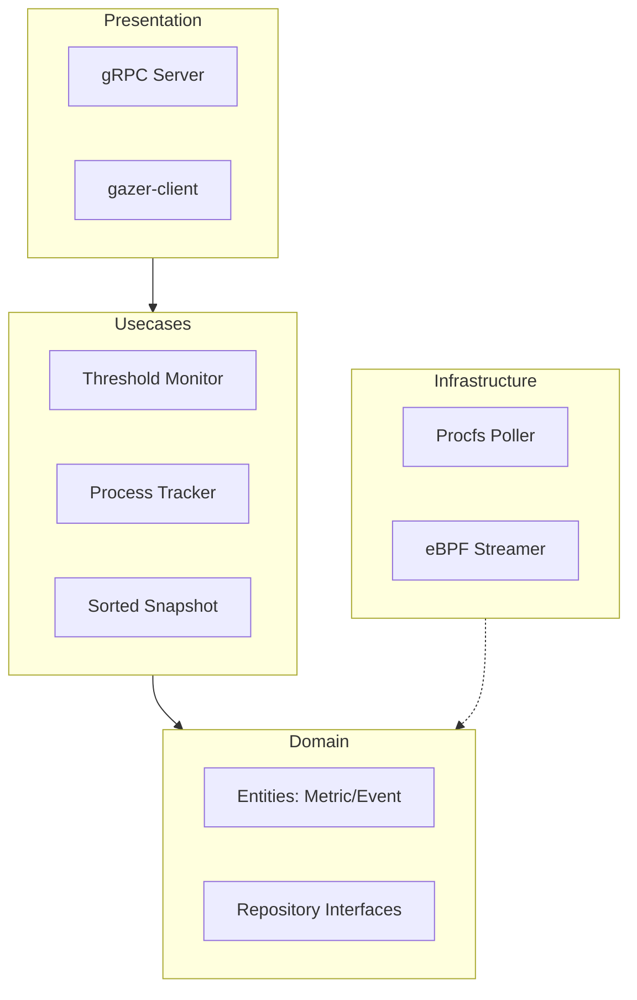

# Gaze: Linux Resource Observer

Gazeは、Linuxシステムの低レイヤーリソース（プロセス、CPU、メモリ）を監視し、特定のドメインイベント（起動・終了・負荷上昇）を検知・配信する監視エージェントです。

Goの並行処理（Goroutines/Channels）と eBPF を組み合わせ、非同期かつ低遅延なメトリクスパイプラインを構築しています。

## 🚀 Key Features

- **リアルタイム監視**: gRPC ストリーミングによる低遅延なデータ配信。
- **eBPF Integration**: `sched_process_exec/exit` フックによる、ポーリングなしの即時プロセス検知。
- **高度な並列処理**: 収集、判定、配信を Pipeline 状に結合したアーキテクチャ。
- **柔軟なソート**: CPU・メモリ使用率でのランキング取得（Top N）。
- **閾値アラート**: プロセスごとのリソース消費量に基づいたアラートイベント発行。

## 🏗 Architecture

本プロジェクトは **The Clean Architecture** に基づき、ビジネスロジックとインフラ実装を厳密に分離しています。



- **Domain**: `entity` と `repository` インターフェースを定義。
- **Usecase**: 上位の監視ルール（「プロセスの死活監視」「リソース閾値判定」など）を実装。
- **Infrastructure**: `/proc` のパースや eBPF のロードといった具体的な外部依存を実装。

## 💻 Usage

### 🛠 Prerequisites

- Go 1.25+
- [Devbox](https://github.com/jetpack-io/devbox) (推奨) または各種ビルドツール (`clang`, `llvm`, `libbpf`, `protoc`)

### 1. ビルド
```bash
devbox run build
# または
go build ./cmd/gazer
go build ./cmd/gazer-client
```

### 2. サーバーの起動
```bash
# procfsモードで起動（デフォルト）
./gazer -port 50051 -threshold-cpu 80.0

# 特定プロセスの起動・終了を監視する場合
./gazer -watch qdrant,ollama
```

### 3. クライアントでの購読
```bash
# CPU順でTop 10を表示
./gazer-client -sort cpu -top 10
```

## 🧪 Development

### eBPFコードの生成
eBPFプログラム (`gaze.c`) を Go に埋め込むには、以下のコマンドを実行します。
```bash
devbox run generate
```

### テストの実行
```bash
devbox run test
```

## 📜 License
MIT
